# AI Content Marketing Optimizer
A production-ready, modular AI system for generating, optimizing, scheduling, analyzing, and automatically improving content performance across social media platforms.
The system integrates LLM-based content generation, trend intelligence, sentiment analysis, A/B testing, engagement analytics, KPI tracking, and continuous ML retraining.

---

## 🚀 Features

### 1. Content Intelligence
- AI-based content generation
- Dynamic prompt builder
- Trend-aware optimization (Google Trends + Reddit)
- Sentiment, emotion & polarity scoring
- Toxicity and language detection
- Auto-improved content variants

### 2. A/B Testing Engine
- Multi-variant generation
- Automated posting (Twitter/X API ready)
- Engagement extraction (likes, shares, replies)
- Real-time evaluation
- ML-driven winner prediction

### 3. Analytics & Metrics Hub
- CTR, engagement rate, conversions
- Sentiment ratio distribution
- Trend score aggregation
- Polarity analysis
- Emotion breakdown
- Toxicity scoring
- Google Sheets automatic logging

### 4. Automated Model Retraining
- Scheduled retraining using APScheduler
- SMOTE balancing
- RandomForest + GridSearchCV hyperparameter tuning
- Model versioning
- Slack notification on new model

---

## 🏗 System Architecture (Mermaid)

```mermaid
flowchart TD

A[User • Streamlit UI] --> B[Content Engine]
A --> M[AB Testing Module]
A --> C[Metrics Dashboard]

B --> T[Trend Fetcher]
B --> S[Sentiment Engine]

M --> P[Social Poster]
P --> X[(Twitter/X API)]

X --> I[Social Ingestor]
I --> H[Metrics Tracker]

H --> GS[(Google Sheets)]
H --> MB[Metrics Hub]

MB --> ML[ML Engine]
ML --> R[Auto Retrainer]
R --> SL[Slack Notifier]
```



---

## 🔄 Workflow Overview (Mermaid)


---

## 📂 Project Structure

```
content-marketing-optimizer/
│── app4.py
│── run.py
│── requirements.txt
│── README.md
│── .env
│
├── app/
│   ├── ab_testing/
│   ├── content_engine/
│   ├── integrations/
│   ├── metrics_engine/
│   ├── ml_engine/
│   └── sentiment_engine/
│
├── data/
├── models/
└── credentials/
```

---

## ⚙️ Installation

### 1. Clone Repository
```
git clone https://github.com/sunil11122251/content-marketing-optimizer.git
cd content-marketing-optimizer
```

### 2. Virtual Environment
```
python -m venv venv
venv\Scripts\activate
```

### 3. Install Dependencies
```
pip install -r requirements.txt
python -m spacy download en_core_web_sm
python -m textblob.download_corpora
```

---

## 🔧 Environment Variables

Create a `.env` file:

```
GOOGLE_SHEET_ID=

SLACK_WEBHOOK_URL=

# Reddit
REDDIT_CLIENT_ID=
REDDIT_CLIENT_SECRET=

# Twitter/X
TWITTER_API_KEY=
TWITTER_API_SECRET=
TWITTER_ACCESS_TOKEN=
TWITTER_ACCESS_SECRET=
TWITTER_BEARER_TOKEN=
```

---

## 🧠 ML Engine
- Labels success using >2% conversion rate
- Feature engineering from CTR, sentiment, polarity, trend score, conversions
- SMOTE for class balancing
- RandomForestClassifier
- GridSearchCV for tuning
- Model automatically versioned

---

## 📊 Google Sheets Integration
The system automatically logs:
- Sentiment
- Engagement metrics
- A/B results
- KPI summaries
- Model versions

---

## 📢 Slack Notifications
Used for:
- Deploy success
- New model retraining
- Fallback and error notifications

---

## 🧑‍💻 Developer Notes
- Modular architecture
- Each engine independent
- Cleanly separated integrations
- Production-grade logging
- Error handling + fallback models

---

## 🚀 Future Improvements
- LinkedIn/Instagram posting
- Image & video generation (multimodal)
- Reinforcement learning for optimization
- RAG for content idea pipelines
